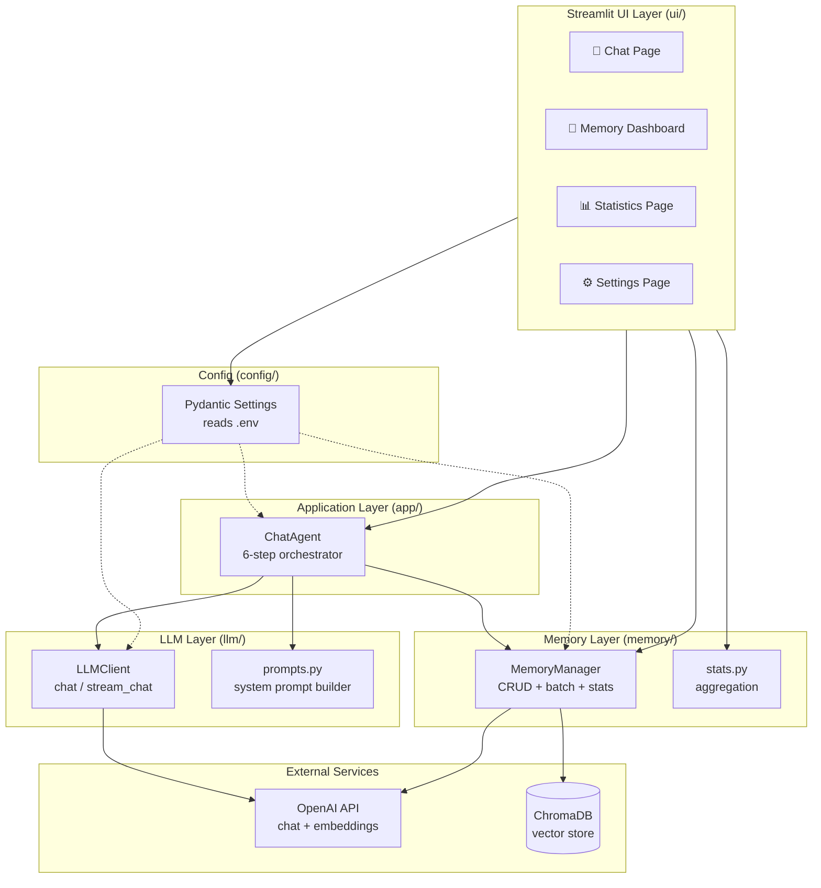
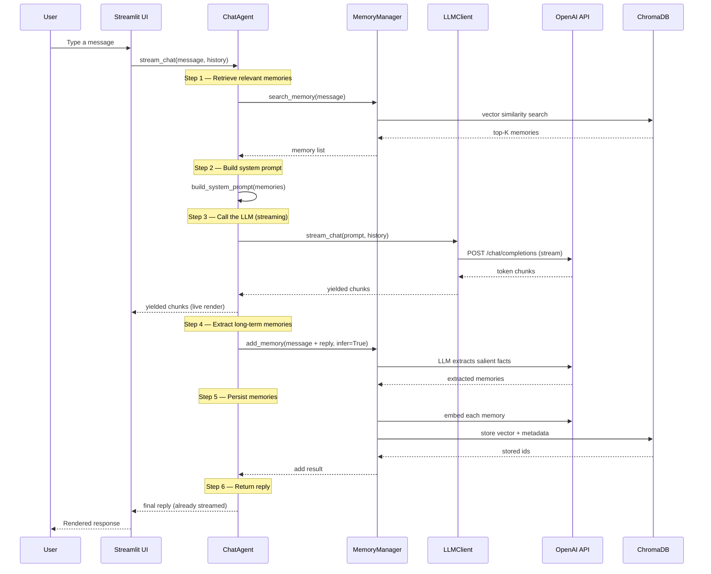

# 🧠 MemoryChat-Agent

> An AI Assistant with Long-Term Memory — a complete **Agent Memory Management System** powered by [mem0](https://github.com/mem0ai/mem0).

MemoryChat-Agent is not just a chatbot. It is a full-featured **Agent Memory
Management System** that automatically extracts, stores, retrieves, and
visualizes long-term memories so the assistant can personalize answers across
sessions.

Built on OpenAI + mem0 + ChromaDB, the project ships with a modern Streamlit
web UI featuring four pages:

- **💬 Chat** — continuous conversation with memory-augmented, streaming replies.
- **🧠 Memory Dashboard** — full CRUD with pagination, sorting, filtering,
  batch delete/export/import, and semantic search.
- **📊 Statistics** — Memory Analytics with health score, category pie,
  daily-additions line chart, and top-tags bar chart (Plotly).
- **⚙️ Settings** — read-only view of the active runtime configuration.

---

## ✨ Features

- **Long-term memory** — automatic extraction & retrieval of relevant memories
  via mem0's LLM-driven memory pipeline.
- **Memory Dashboard** — full CRUD with pagination, sorting, filtering, batch
  delete/export/import, and semantic search.
- **Memory Analytics** — statistics page with health score, category breakdown,
  daily-additions trend, and top tags (Plotly charts).
- **Continuous chat** — multi-turn conversations with session history and
  streaming output.
- **Zero hardcoding** — all secrets and model names live in `.env`, loaded with
  Pydantic Settings.
- **Reproducible builds** — managed with [`uv`](https://docs.astral.sh/uv/) and
  a committed `uv.lock`.
- **Containerized** — one-command startup with Docker Compose, including
  project-directory bind-mounting for live code reloading.
- **Tested** — 131 unit tests with 95%+ coverage on core modules.

---

## 🧱 Tech Stack

| Layer           | Technology                        |
| --------------- | --------------------------------- |
| Language        | Python 3.12                       |
| Package manager | uv                                |
| UI              | Streamlit                         |
| LLM             | OpenAI SDK (chat + embeddings)    |
| Memory engine   | mem0                              |
| Vector store    | ChromaDB                          |
| Config          | Pydantic Settings + python-dotenv |
| Charts          | Plotly                            |
| Logging         | Rich                              |
| CLI (optional)  | Typer                             |
| Testing         | pytest + pytest-cov               |
| Linting         | Ruff                              |

---

## 📁 Project Structure

```
memory-chat-agent/
├── app/                    # Application layer
│   ├── agent.py            #   ChatAgent — 6-step workflow orchestrator
│   ├── exceptions.py       #   Agent exception hierarchy
│   └── main.py             #   Streamlit entry point + sidebar
├── ui/                     # Streamlit UI layer (thin adapters)
│   ├── chat_page.py        #   Chat page with status strip
│   ├── dashboard_page.py   #   Memory Dashboard entry (4 tabs)
│   ├── dashboard_all_tab.py    # All Memories tab (CRUD + batch)
│   ├── dashboard_search_tab.py # Semantic search tab
│   ├── dashboard_add_tab.py    # Add memory tab
│   ├── dashboard_batch_tab.py  # Batch export/import/clear tab
│   ├── dashboard_helpers.py    # Dashboard session-state helpers
│   ├── stats_page.py       #   Statistics page (Plotly charts)
│   ├── settings_page.py    #   Settings page (read-only config)
│   ├── components.py       #   Reusable UI components
│   ├── widgets.py          #   Pagination, dialogs, metric grid
│   └── sort_filter.py      #   Sort/filter toolbar
├── memory/                 # Memory subsystem (wraps mem0)
│   ├── manager.py          #   MemoryManager — CRUD + batch + stats
│   ├── stats.py            #   Pure-function statistics aggregation
│   ├── types.py            #   TypedDict definitions
│   └── exceptions.py       #   Memory exception hierarchy
├── llm/                    # LLM subsystem (wraps OpenAI SDK)
│   ├── client.py           #   LLMClient — chat + stream_chat
│   ├── prompts.py          #   System prompt templates
│   └── exceptions.py       #   LLM exception hierarchy
├── config/                 # Configuration
│   └── settings.py         #   Pydantic Settings (loads .env)
├── utils/                  # Shared utilities
│   └── logger.py           #   Rich-based logger
├── tests/                  # Unit tests (131 tests, fully offline)
├── data/                   # ChromaDB persistence (git-ignored)
├── screenshots/            # UI screenshots for docs
├── docs/                   # Additional documentation
├── Dockerfile              # Multi-stage build (uv + python:slim)
├── docker-compose.yml      # Compose with project-dir mount
├── pyproject.toml          # Dependencies + tool config
├── uv.lock                 # Locked dependency versions
├── .env.example            # Environment variable template
├── .dockerignore
├── .gitignore
├── LICENSE
├── CHANGELOG.md
└── README.md
```

---

## 🚀 Installation

### Prerequisites

- [Python 3.12](https://www.python.org/downloads/)
- [uv](https://docs.astral.sh/uv/getting-started/installation/)
- An [OpenAI API key](https://platform.openai.com/api-keys) (or any
  OpenAI-compatible endpoint)

### 1. Clone the repository

```bash
git clone https://github.com/your-username/MemoryChat-Agent.git
cd MemoryChat-Agent
```

### 2. Configure environment variables

```bash
cp .env.example .env
```

Edit `.env` and fill in your real values (at minimum `OPENAI_API_KEY`).

### 3. Install dependencies

```bash
uv sync
```

This creates a `.venv` virtual environment and installs all dependencies from
`uv.lock` for reproducible builds.

---

## 📦 Using uv

This project uses [`uv`](https://docs.astral.sh/uv/) for fast, reproducible
dependency management. Below are the commands you will use most often.

### Install dependencies

```bash
uv sync                  # install runtime deps from uv.lock
uv sync --extra dev      # also install dev tools (pytest, ruff, mypy)
```

### Run commands inside the project venv

`uv run` executes a command inside the project's virtual environment without
needing to activate it manually:

```bash
uv run streamlit run app/main.py   # start the Streamlit app
uv run memory-chat                  # run the registered CLI script
uv run pytest                       # run the test suite
uv run ruff check .                 # lint
```

### Add / remove dependencies

```bash
uv add plotly                       # add a runtime dependency
uv add --dev pytest-cov             # add a dev dependency
uv remove pandas                    # remove a dependency
```

`uv` updates `pyproject.toml` and `uv.lock` together, keeping them in sync.

### Lock & sync

```bash
uv lock                              # regenerate uv.lock from pyproject.toml
uv sync --frozen                     # install exactly from uv.lock (CI-safe)
```

### Why uv?

- **10–100× faster** than pip/poetry for dependency resolution.
- A single `uv.lock` guarantees identical environments across machines and
  the Docker image.
- `uv run` removes the need to manually activate virtualenvs.

---

## ⚙️ Configuration

All configuration is read from environment variables (loaded from `.env`).
No secrets are hardcoded in source. See [`.env.example`](.env.example) for the
full list and descriptions.

| Variable                  | Description                        | Default                     |
| ------------------------- | ---------------------------------- | --------------------------- |
| `OPENAI_API_KEY`          | OpenAI API key (required)          | —                           |
| `OPENAI_BASE_URL`         | OpenAI-compatible API base URL     | `https://api.openai.com/v1` |
| `OPENAI_MODEL`            | Chat completion model              | `gpt-4o-mini`               |
| `OPENAI_EMBEDDING_MODEL`  | Embedding model                    | `text-embedding-3-small`    |
| `MEM0_VECTOR_STORE`       | mem0 vector store provider         | `chroma`                    |
| `MEM0_VECTOR_STORE_PATH`  | ChromaDB persistence path          | `./data/chroma`             |
| `MEM0_COLLECTION_NAME`    | ChromaDB collection name           | `mem0`                      |
| `MEM0_LLM_PROVIDER`       | mem0 LLM provider                  | `openai`                    |
| `MEM0_EMBEDDER_PROVIDER`  | mem0 embedder provider             | `openai`                    |
| `MEM0_DEFAULT_USER_ID`    | Default user id for memory scoping | `default_user`              |
| `APP_NAME`                | Application display name           | `MemoryChat-Agent`          |
| `APP_VERSION`             | Application version string         | `0.1.0`                     |
| `APP_PORT`                | Streamlit server port              | `8501`                      |
| `LOG_LEVEL`               | Logging verbosity                  | `INFO`                      |
| `DEBUG`                   | Debug mode toggle                  | `false`                     |

---

## ▶️ Running the App

### Local (uv)

```bash
uv run streamlit run app/main.py
```

The app will be available at <http://localhost:8501>.

> Tip: You can also use the registered script: `uv run memory-chat`

### Docker

See the [Docker](#-docker) section below.

---

## 🐳 Docker

The project ships with a multi-stage `Dockerfile` and a `docker-compose.yml`.
All environment variables are read from the `.env` file (via `env_file` and a
read-only bind-mount), so no secrets are baked into the image.

### Prerequisites

- [Docker](https://docs.docker.com/get-docker/) 20.10+
- [Docker Compose](https://docs.docker.com/compose/install/) v2+
- A `.env` file in the project root (copy from `.env.example` and fill in values)

### Build

```bash
docker compose build              # build the image
docker compose build --no-cache   # rebuild from scratch
```

### Run

```bash
docker compose up        # foreground (logs stream to terminal)
docker compose up -d     # detached (background)
```

The app will be available at <http://localhost:8501>.

### Stop

```bash
docker compose down      # stop & remove containers (keeps data volume)
docker compose down -v   # also wipe the ChromaDB memory volume
```

### Logs

```bash
docker compose logs -f                       # follow live logs
docker compose logs --tail 100               # last 100 lines
docker compose logs -f memory-chat-agent     # service only
```

### Debugging & Project Directory Mounting

The `docker-compose.yml` **bind-mounts the project directory** into the
container at `/app`:

```yaml
volumes:
  - .:/app                    # host source code → container
  - /app/.venv                # anonymous volume protects the container venv
  - memory-data:/app/data     # named volume persists ChromaDB
  - ./.env:/app/.env:ro       # read-only config
```

This means:

- **Live code reloading** — edit any `.py` file on the host and Streamlit
  auto-reloads inside the container. No rebuild needed.
- **Protected virtualenv** — the container-built `.venv` is shielded by an
  anonymous volume so the host's environment never clobbers it.
- **Persistent memories** — ChromaDB data lives in the `memory-data` named
  volume and survives `docker compose down`.

#### Common debugging commands

```bash
docker compose exec memory-chat-agent bash                                    # shell
docker compose exec memory-chat-agent python -c "from memory.manager import MemoryManager; print('OK')"
docker compose exec memory-chat-agent python -m pytest tests/ -q              # tests
docker stats memory-chat-agent                                                # resources
docker inspect --format='{{.State.Health.Status}}' memory-chat-agent          # health
```

### Environment Variables in Docker

All configuration comes from `.env`. The file is:

1. Injected as container environment variables via `env_file: .env`.
2. Bind-mounted read-only at `/app/.env` so Pydantic Settings can also read it.

To change configuration, edit `.env` on the host and restart:

```bash
docker compose restart
```

---

## 🧬 Memory Principles

MemoryChat-Agent gives the assistant a **long-term, personalized memory** layer
built on [mem0](https://github.com/mem0ai/mem0). The memory pipeline works as
follows:

### How memories are formed

1. **Extraction** — When a user sends a message, mem0 uses an LLM to extract
   salient facts/preferences (e.g. "the user prefers dark mode") from the
   conversation.
2. **Embedding** — Each extracted memory is embedded with OpenAI's embedding
   model (`text-embedding-3-small` by default).
3. **Storage** — The embedding + metadata is persisted in ChromaDB, a local
   vector database, under a user-scoped collection.
4. **Retrieval** — On the next turn, the user's query is embedded and ChromaDB
   returns the most semantically similar memories.
5. **Injection** — Retrieved memories are injected into the system prompt so
   the LLM can personalize its reply.

### Why this matters

Without long-term memory, every conversation starts from scratch. With mem0:

- The assistant **remembers** user preferences across sessions.
- Memories are **semantic** — "I like Python" matches a query about
  "favorite programming language".
- Memories are **scoped per user** (`MEM0_DEFAULT_USER_ID`), enabling
  multi-user isolation.
- The Memory Dashboard exposes the full memory store for **transparency and
  control** — users can view, edit, delete, and audit what the agent knows.

### Memory vs. chat history

| Aspect        | Chat history              | Long-term memory (mem0)            |
| ------------- | ------------------------- | ---------------------------------- |
| Scope         | Single session            | Cross-session, persistent          |
| Storage       | In-memory (`session_state`) | ChromaDB vector store              |
| Retrieval     | Sequential (last N turns) | Semantic similarity search         |
| Extraction    | None (raw messages)       | LLM-distilled facts/preferences    |
| Editable      | No (clear only)           | Yes (full CRUD via Dashboard)      |

---

## 🏗️ System Architecture



The architecture enforces strict **layering and dependency direction**:

- **UI → App → (LLM, Memory)** — the UI never touches OpenAI or ChromaDB
  directly; it goes through `ChatAgent` and `MemoryManager`.
- **Config is read-only** — every layer reads from `config.settings`, which
  loads `.env` once at startup.
- **External services are isolated** — only `LLMClient` talks to OpenAI, and
  only `MemoryManager` talks to ChromaDB/mem0.

---

## 🔄 Agent Workflow

Every user message triggers a **6-step workflow** inside `ChatAgent`. The UI
layer is a thin adapter that calls `agent.stream_chat()` and renders the
streamed chunks.



### Key design decisions

- **Steps 4–5 are non-blocking to the reply** — memory extraction &
  persistence happen after the reply is streamed, so the user sees the answer
  immediately. Failures here are logged as warnings, not surfaced as errors.
- **`infer=True` on add** — lets mem0's LLM decide what's worth remembering,
  rather than storing raw messages verbatim.
- **Manual add uses `infer=False`** — when a user adds a memory via the
  Dashboard, it's stored as-is (deterministic, no extra LLM call).

---

## 📸 Screenshots

> Screenshots are stored in the [`screenshots/`](screenshots/) directory. Add
> your own captures after running the app.

| Page              | Screenshot                          |
| ----------------- | ----------------------------------- |
| 💬 Chat           | `screenshots/chat.png`              |
| 🧠 Dashboard      | `screenshots/dashboard.png`         |
| 📊 Statistics     | `screenshots/statistics.png`        |
| ⚙️ Settings       | `screenshots/settings.png`          |

To capture your own:

1. Start the app: `uv run streamlit run app/main.py`
2. Open <http://localhost:8501> in your browser.
3. Navigate to each page and take a screenshot.
4. Save the images to `screenshots/` with the names above.

---

## 📅 Development Plan

The project is developed in incremental phases. Completed phases are marked
with ✅.

- ✅ **Phase 1 — Scaffolding**: `uv` project, Pydantic Settings, Docker,
  directory structure.
- ✅ **Phase 2 — Memory module**: `MemoryManager` wrapping mem0 SDK (CRUD +
  search), 32 unit tests.
- ✅ **Phase 3 — LLM module**: `LLMClient` wrapping OpenAI SDK (chat +
  stream), centralized prompts, 33 unit tests.
- ✅ **Phase 4 — ChatAgent**: 6-step workflow orchestrator, 27 unit tests.
- ✅ **Phase 5 — Streamlit WebUI**: Chat / Memory / Config pages + sidebar.
- ✅ **Phase 6 — Memory Dashboard**: full CRUD, pagination, sorting,
  filtering, batch operations, semantic search.
- ✅ **Phase 7 — Statistics**: Memory Analytics with Plotly charts and
  health score.
- ✅ **Phase 8 — Docker**: multi-stage Dockerfile, compose with project-dir
  mount, README documentation.
- ⬜ **Phase 9 — Advanced features** (see [Future Work](#-future-work)).

### Development commands

```bash
uv sync --extra dev              # install dev dependencies
uv run pytest                    # run all 131 tests
uv run pytest --cov              # run tests with coverage
uv run ruff check .              # lint
uv run ruff check . --fix        # lint + autofix
uv run ruff format .             # format
```

---

## 📜 License

This project is licensed under the [MIT License](LICENSE).

```
MIT License

Copyright (c) 2026 MemoryChat-Agent

Permission is hereby granted, free of charge, to any person obtaining a copy
of this software and associated documentation files (the "Software"), to deal
in the Software without restriction, including without limitation the rights
to use, copy, modify, merge, publish, distribute, sublicense, and/or sell
copies of the Software, and to permit persons to whom the Software is
furnished to do so, subject to the following conditions:

The above copyright notice and this permission notice shall be included in all
copies or substantial portions of the Software.

THE SOFTWARE IS PROVIDED "AS IS", WITHOUT WARRANTY OF ANY KIND, EXPRESS OR
IMPLIED, INCLUDING BUT NOT LIMITED TO THE WARRANTIES OF MERCHANTABILITY,
FITNESS FOR A PARTICULAR PURPOSE AND NONINFRINGEMENT. IN NO EVENT SHALL THE
AUTHORS OR COPYRIGHT HOLDERS BE LIABLE FOR ANY CLAIM, DAMAGES OR OTHER
LIABILITY, WHETHER IN AN ACTION OF CONTRACT, TORT OR OTHERWISE, ARISING FROM,
OUT OF OR IN CONNECTION WITH THE SOFTWARE OR THE USE OR OTHER DEALINGS IN THE
SOFTWARE.
```

---

## 🔮 Future Work

The current system is a solid foundation. Planned advanced features:

1. **Memory Summarization** — use an LLM to summarize large memory stores into
   compact digests, preventing context-window bloat during retrieval.
2. **Memory Graph** — build a relationship graph between memories (entity
   links, causal edges) and support graph-based retrieval queries.
3. **Multi-user Memory** — proper multi-tenant isolation with per-user
   authentication, scoping, and permission management.
4. **Memory Versioning** — track edit history per memory, with diff view and
   rollback support in the Dashboard.
5. **Memory Decay / Forgetting** — time- and access-frequency-based decay so
   low-value memories are automatically archived or pruned.
6. **Memory Importance Scoring** — LLM-assigned importance scores that
   influence retrieval ranking and decay scheduling.
7. **Memory Deduplication** — semantic deduplication to merge near-identical
   memories and keep the store clean.
8. **Advanced Search Filters** — combine semantic search with category, tag,
   and date-range filters.
9. **Real-time Memory Stream** — WebSocket push so users can watch the agent
   extract memories in real time during a chat.
10. **Export Formats** — support Markdown, CSV, and Anki-card exports in
    addition to JSON.
11. **Plugin System** — allow custom memory extractors or retrievers to be
    registered via entry points.
12. **Observability** — structured tracing of each 6-step workflow run for
    debugging and performance analysis.

---

> Built with ❤️ using [mem0](https://github.com/mem0ai/mem0),
> [Streamlit](https://streamlit.io/), [uv](https://docs.astral.sh/uv/), and
> [OpenAI](https://openai.com/).
